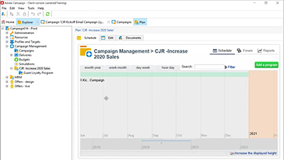

# Adobe Campaign v8 Client Console Tutorials

Adobe Campaign erbjuder en plattform för att utforma kundupplevelser över flera kanaler och tillhandahåller en miljö för visuell kampanjorkestrering, interaktionshantering i realtid och körning över flera kanaler. Den här användarhandboken innehåller videor och självstudiekurser om de många funktionerna i Adobe Campaign V8 Client Console.

Se

>[!INFO]
> Har du frågor? Vill du dela med dig av dina erfarenheter eller utbyta tankar med andra? Eller har du feedback på kursmaterialet för Adobe-teamet? Delta i konversationen i [Adobe Campaign Learning Community-tråden](https://experienceleaguecommunities.adobe.com:443/t5/adobe-campaign-classic/join-the-discussion-on-adobe-campaign-learning/td-p/419096)!
> 
> De här självstudiekurserna är inte vad du letar efter?
> Se [Adobe Campaign självstudiekurser för webbanvändargränssnitt](https://experienceleague.adobe.com/docs/campaign-web-learn/tutorials/overview.html) om du vill ha vägledning om hur du använder webbgränssnittet för Campaign.

>[!NOTE]
> Campaign v8 är för närvarande bara tillgängligt som en hanterad Cloud Service och kan inte distribueras i en lokal miljö eller hybridmiljö. Automatisk migrering från en befintlig Campaign Classic v7-miljö är inte tillgänglig än.
>
>Se [produktdokumentation](https://experienceleague.adobe.com/docs/campaign/campaign-v8/new/v7-to-v8.html?lang=sv) om du vill ha mer information om övergången från Classic v7 till V8.

## Personalval

<table>
<tr>
  <td>
    
    

      <a href="/help/get-started/create-a-marketing-plan-programs-and-campaigns.md">
    <strong>Skapa en marknadsföringsplan</strong>
    </a>
    

    

    <em>Lär dig hur du skapar en marknadsföringsplan, program och kampanj.</em>
    

  </td>
   <td>
    
    

      <a href="./content-creation/create-and-design-email-deliveries.md">
    <strong>Skapa och utforma e-postleveranser</strong>
    </a>
    

    

    <em>Förstå processen med att skapa e-postleveranser och lär dig hur du utformar och anpassar e-postinnehåll.
</em>
    

  </td>
  <td>
    
    

      <a href="./send-messages/fatigue-management/typology-rules-for-fatigue-management.md">
    <strong>Hantera trötthet med typologiregler</strong>
    </a>
    

    

    <em>Lär dig hur du implementerar trötthetshantering i Adobe Campaign med hjälp av typologiregler. </em>
    

  </td>
</tr>
<tr>
</td>
  <td>
    
    

      <a href="./reporting/generate-a-descriptive-analysis-report.md">
    <strong>Generera en beskrivande analysrapport</strong>
    </a>
    

    

    <em>Läs om hur du skapar en beskrivande analysrapport från ett arbetsflöde.</em>
    

  </td>
  <td>
   
     

      <a href="./data-management/data-management-fundamentals.md">
    <strong>Grundläggande om datahantering med arbetsflöden</strong>
    </a>
    

    

    <em>Läs om vad målgruppsmått och arbetstabeller är och hur Adobe Campaign hanterar data över olika datakällor.</em>
    

  </td>
  <td>
   
     

      <a href="./data-management/api-staging-mechanism.md">
    <strong>API-mellanlagringsmekanism med FFDA</strong>
    </a>
    

    

    <em>Läs om hur API-mellanlagringsmekanismen med fullständig FDA fungerar.</em>
    

  </td>
</tr>
</table>

